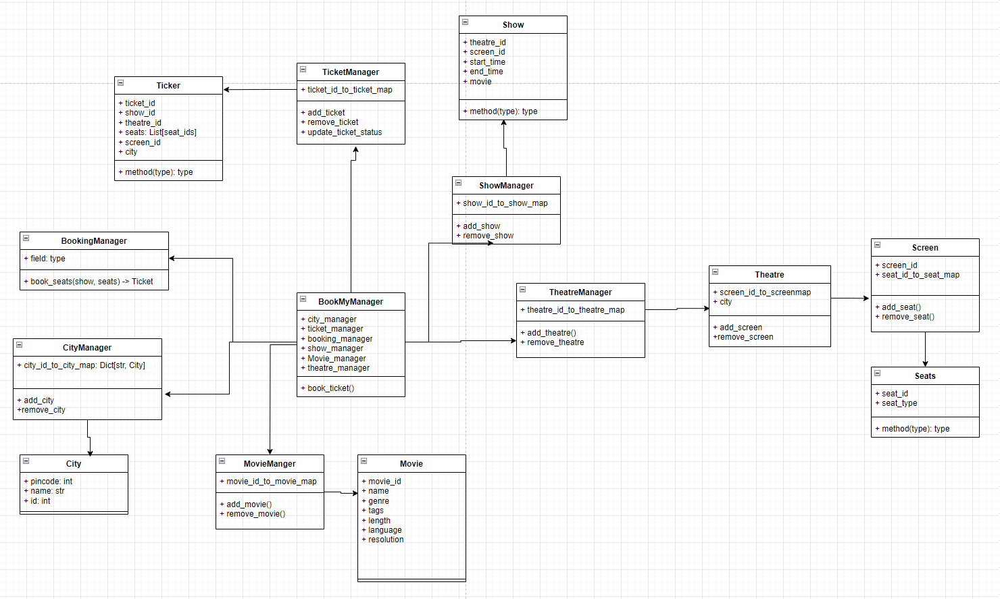

# Designing Book My Show

## Requirements
- The user should be able to select multiple seats according to their choice.
- The user should be able to distinguish between available seats from the booked ones.
- Users should be able to put a hold on the seats for 2 minutes before they make a payment to finalize the booking.
- If the payment fails or takes more than 2 minutes then the seats that are put on hold in the previous step are made available after 2 minutes.

## Class Diagram

